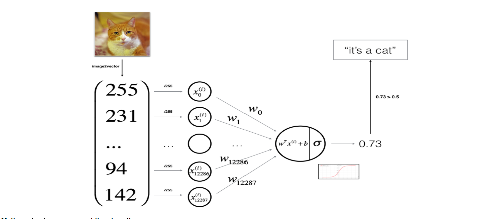

This project is to identify an image as cat or non-cat with logistic regerssion. The main steps as follows:
## Load/explore/preprocessing dataset.
- data is stored in h5 format, using h5py to read.
- input X is the images with shape (m,n_height,n_width,n_channel), output Y is the classification (=1, is a cat, =0, not a cat), with shape(1,m).
- input X will be first reshaped to (n_h*n_w*n_c,m) and then standarized by '/255' to better fit with NN model.
## Define the model structure


with only 1 layer -- the output layer, and only 1 unit in that layer.
## Construct the model
### Initiate the parameters
weights W with shape (1,n_x). n_x is the dimension[0] of input X, equals to n_h*n_w*n_c.
bias b is a scalar.
### In num_iterations do Propagation and update parameters
#### Forward prpagation
```
input X

Z = W.T*X

Y_hat = A = sigmoid(Z)
```
#### Compute cost
`J = (-1/m)*sum(Y*log(A)+(1-Y)*log(1-A))`
#### Backward propogation
```
dZ = A-Y

dW = (1/m)*(dZ*X.T)

db = (1/m)*sum(dZ)
```
#### Update parameters
```
W := W - learning_rate * dW

b := b - learning_rate *db
```
## Train and evaluate the model 
- Train the model with preprocessed dataset
- with the trained model (optimized parameters) and train_set_X to predict Y_hat_train, compared with ground truth Y_train to get ** train accuracy** of this model.
- with the trained model (optimized parameters) and test_set_X to predict Y_hat_test, compared with ground truth Y_test to get ** test accuracy** of this model.
